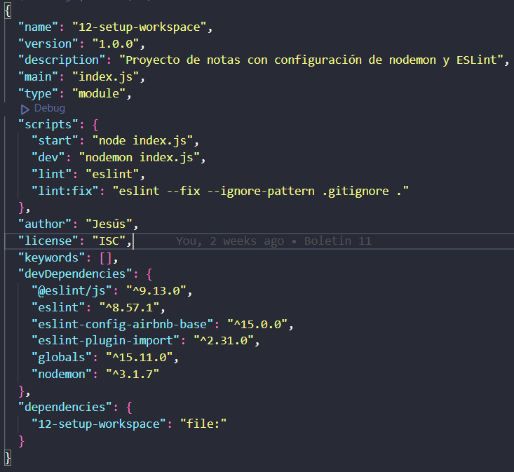

# Configuración Eslint

Este proyecto está diseñado para configurar un entorno de desarrollo utilizando herramientas **ESlint** para mejorar la calidad del código. A continuación se detallan los pasos para realizar los ejercicios requeridos.

## Ejercicios

### Ejercicio 1: Configurar el proyecto para detectar errores de estilo de código

1. **Instalación de ESLint**: Ejecuta el siguiente comando en tu terminal:

   ```bash
   npm install -D eslint
   ```

2. **Inicializar ESLint**: Inicia ESLint con la configuración inicial usando:

   ```bash
   npx eslint --init
   ```

   Responde las preguntas para configurar ESLint según tus necesidades.

3. **Configurar los scripts del package.json**: Añade scripts para facilitar la ejecución de detección de fallos:

    ```json
    "scripts": {
      "lint": "eslint --ignore-path .gitignore .",
      "lint:fix": "eslint --fix --ignore-path .gitignore ."
    }
    ```

### Ejercicio 2: Detectar y corregir malas prácticas y estilos en el código con ESlint

1. **Ejecutar el análisis de ESLint**: Para validar el código y ver los errores de estilo, utiliza:

   ```bash
   npx eslint .
   ```

   o

   ```bash
   npm run lint
   ```

2. **Corregir automáticamente los errores**: Para que ESLint intente corregir los errores automáticamente, usa:

   ```bash
   npx eslint --fix .
   ```

   o

   ```bash
   npm run lint:fix
   ```

### Ejercicio 3: Ver errores en el código

1. Copia el siguiente código en un archivo `.js`:

   ```javascript
   const chalk = require('chalk');

   var youShouldNeverUseVar = "This is my very long line that eslint should check as an error ............................................";

   function myFunction(used, nonUsed){
       if(used){
           console.log(used);
           return;
       }
   }

   module.exports = nonExistingVar;
   ```

2. Ejecuta ESlint sobre este archivo para ver los errores y advertencias generados.

---

### Ejercicio 4: Corregir el código según la guía de estilos de Airbnb

**NOTA**: La guía de estilos de Airbnb lleva mucho tiempo sin actualizarse y da muchos problemas tanto al instalarla como al ejecutarla. Te recomendamos que, para estudiar y repasar conceptos, te concentres en los ejercicios 1 a 3, que cubren la configuración básica de ESLint y la detección de errores de estilo sin necesidad de implementar la guía de estilos de Airbnb.

Si decides seguir este ejercicio, puedes proceder de la siguiente manera:

1. **Instalar la configuración de Airbnb**:

   Este comando instala las dependencias necesarias para ESLint y la configuración de Airbnb (debe ser este ya que las versiones actuales de Eslint no son compatibles con las de Airbnb, por tanto, este codigo iguala las dependencias de uno a otro):

     ```bash
   npm install --save-dev eslint eslint-plugin-import eslint-config-airbnb-base --legacy-peer-deps
     ```

2. Modifica el archivo `eslint.config.mjs` para extender la configuración de Airbnb:

   ```javascript
   // eslint.config.mjs
   import airbnbBase from 'eslint-config-airbnb-base';

   export default [
     {
       // Incluye directamente las reglas de airbnb-base
       rules: {
         ...airbnbBase.rules, // Copia las reglas de airbnb-base directamente
         // Puedes agregar reglas adicionales aquí si lo necesitas
       },
     },
   ];

3. Vuelve a ejecutar ESLint para ver los errores y corrígelos según las recomendaciones de Airbnb.

Revisa que el archivo `package.json` tenga esta configuración:


